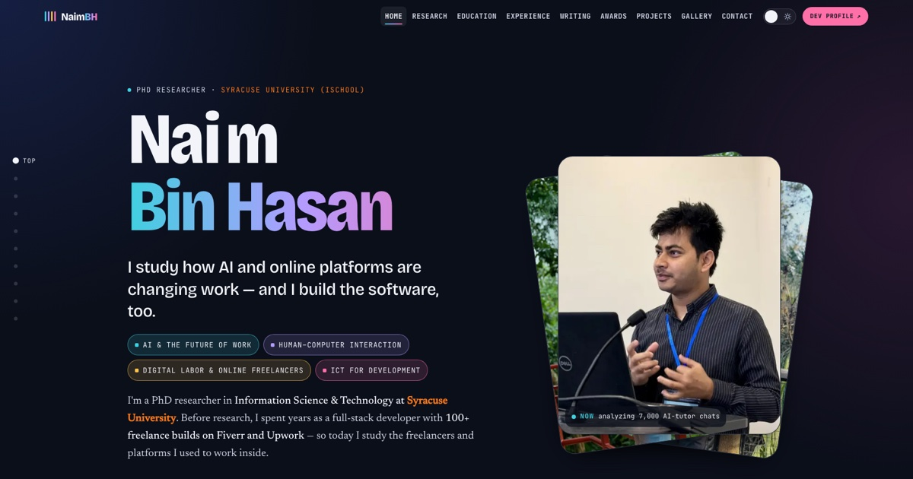
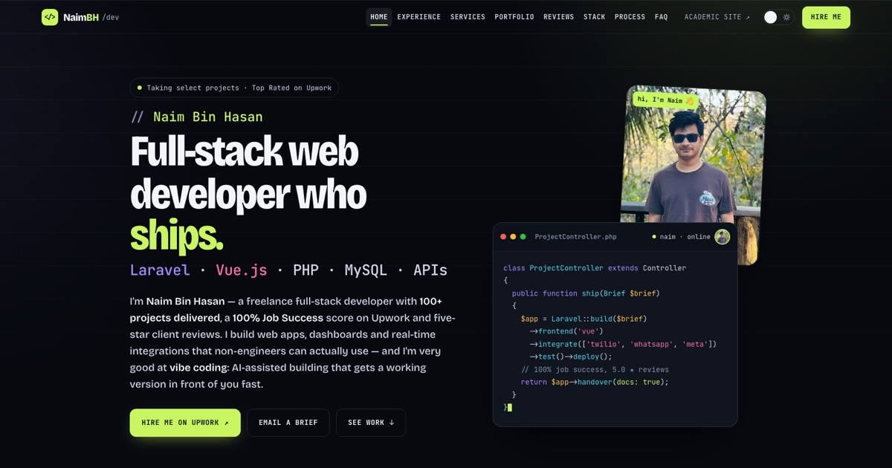

# Naim Bin Hasan: academic site + developer portfolio

[](https://naimbh.com)
[](https://dev.naimbh.com)
[](#how-its-built)
[](LICENSE)

Two fast, search-optimized personal sites in one repo, built with plain HTML, CSS and JavaScript. There's no framework and no build step to deploy.

| | Site | For |
|---|---|---|
|  | **[naimbh.com](https://naimbh.com)**: academic site | Research interests, education, experience, publications, awards, projects, photo gallery, contact |
|  | **[dev.naimbh.com](https://dev.naimbh.com)**: developer portfolio | Experience, services, filterable project portfolio, client reviews, stack, process, FAQ, hire me |

I'm a PhD researcher in Information Science & Technology at the **Syracuse University iSchool**. I study AI and the future of work, human–computer interaction, digital labor and online freelancers, and ICT for development. I'm also a full-stack web developer (Laravel, Vue.js, PHP) with 100+ shipped projects. These sites present both sides.

The code is open source. If you're a **researcher who also builds software**, or a **grad student who wants a serious academic site without WordPress or a static-site generator**, fork it and make it yours.

---

## Highlights

**Academic site**
- Hero with a rotating photo stack: photos drop onto a deck behind the main card, with a 3D tilt that follows the cursor.
- Experience written as a "codebook": tag chips (Engineering, Research, Teaching, Digital labor) bring matching roles forward.
- Publications with one-click **copy citation**, and a thesis entry linked to the university repository.
- Separate sections for education and for funding & awards.
- An SEO photo gallery with category filters and a lightbox: keyboard and swipe support, blurred placeholder while the full image loads, preloading of neighbors.
- Office address with a link to maps, and structured address data.

**Developer portfolio**
- Hero with an **editable code window** (`ProjectController.php`): visitors can type in it on desktop.
- Portfolio of 13 projects with category filters and pagination. Each card has a custom SVG illustration instead of a client screenshot.
- Client reviews, tech stack, a four-step process, and an FAQ.

**Both sites**
- Day/night theme that follows the system setting, remembers your choice, and switches with a smooth View Transition.
- Smooth scrolling with [Lenis](https://github.com/darkroomengineering/lenis) for mouse and trackpad. Touch keeps native scrolling.
- Scroll-spy nav, reveal-on-scroll animations, and a scroll progress bar.
- `prefers-reduced-motion` turns all motion off.
- Responsive and checked pixel by pixel at 320, 375 and 768 px and on desktop.

## SEO: built to rank for a name

- **One real page per nav section** (`/research/`, `/publications/`, `/gallery/`, `/portfolio/` …). Each has its own title, description, canonical URL and breadcrumb, which gives Google what it needs to show **sitelinks** under a name search. On the home page, nav clicks still smooth-scroll.
- **JSON-LD `@graph`**: `Person` (one shared `@id` across both domains), `WebSite`, `ProfilePage`, `ScholarlyArticle`, `Thesis`, `ImageGallery` with `ImageObject`s, `ProfessionalService`, `FAQPage`, `BreadcrumbList`, `ContactPage`.
- **Image sitemaps.** Every photo has a descriptive filename (`naim-bin-hasan-syracuse-university-campus-hall-of-languages-960.webp`), a caption and alt text, so the images show up in image search for the name.
- **Social previews** are real screenshots of each site's desktop hero (1200×630), generated by a script. Open Graph and X/Twitter tags match.
- `robots.txt`, a sitemap index, `rel="me"` links to profiles, and 301 redirects for every renamed URL.

## Performance

- Lighthouse at the time of writing: **academic 99 / 100 / 100 / 100**, **dev 100 / 100 / 100 / 100** (Performance / Accessibility / Best Practices / SEO).
- Responsive WebP images (640 / 960 / 1400 w) with `srcset`, lazy loading, explicit dimensions and `fetchpriority` on the hero.
- No framework: the CSS and JS are inline, plus one 13 KB self-hosted script (Lenis).
- Google Analytics 4 loads only after the page is idle, so it never slows the first paint.
- **PWA**: web manifest, maskable icons, and a service worker (pages network-first, assets stale-while-revalidate, offline fallback page).

## How it's built

```
.
├── index.html               ← academic site (single source of truth)
├── research/ education/ experience/ publications/ awards/ projects/ gallery/ contact/
│                            ← generated section pages (don't edit by hand)
├── images/                  ← portrait, gallery (WebP sizes), og/, projects/
├── js/lenis.min.js
├── sitemap.xml  sitemap-main.xml  robots.txt  site.webmanifest  sw.js  404.html  offline.html
├── .htaccess                ← https, www → bare domain, redirects, caching, compression
├── dev/                     ← document root of dev.naimbh.com (fully self-contained)
│   ├── index.html           ← developer portfolio (single source of truth)
│   ├── experience/ services/ portfolio/ reviews/ stack/ process/ faq/ contact/
│   ├── images/  js/  certificates/
│   └── sitemap.xml  robots.txt  site.webmanifest  sw.js  404.html  .htaccess
└── tools/
    ├── build_pages.py       ← builds the section pages + sitemap entries
    └── og_screenshots.sh    ← retakes the social-preview screenshots
```

### Run locally

```bash
python3 -m http.server 8765
```

```bash
python3 -m http.server 8766 -d dev
```

The academic site runs at <http://localhost:8765> and the dev portfolio at <http://localhost:8766>.

### After editing

Edit only `index.html` or `dev/index.html`, then regenerate the section pages and sitemaps:

```bash
python3 tools/build_pages.py
```

If you changed a hero, also refresh the social-preview images (needs Google Chrome on macOS):

```bash
bash tools/og_screenshots.sh
```

### Deploy

The production host is cPanel with LiteSpeed/Apache. `public_html` is a clone of this repo:

```bash
cd ~/public_html && git pull
```

The subdomain `dev.naimbh.com` uses `public_html/dev` as its document root, so the same pull updates both sites. The `.htaccess` files handle https, redirects (`naimbh.com/dev/*` → `dev.naimbh.com/*`), caching and compression. `.cpanel.yml` is there as an alternative for cPanel's "Deploy HEAD Commit".

## Use it as a template

1. Fork the repo and replace the text in `index.html` and `dev/index.html`. Content, meta tags and JSON-LD all live in those two files.
2. Swap in your photos under `images/` and `dev/images/`. Keep the descriptive `your-name-place-640/960/1400.webp` naming.
3. Search and replace `naimbh.com` with your domain, and `G-NQ25CLBB39` with your GA4 ID (or delete the analytics snippet).
4. Edit the page list (titles and descriptions) in `tools/build_pages.py`, then run it.
5. Update `sitemap-main.xml`, `dev/sitemap.xml`, `robots.txt` and both `site.webmanifest` files.
6. Deploy anywhere that serves static files. The `.htaccess` rules are for Apache/LiteSpeed; on Netlify, Vercel or GitHub Pages use their own redirect settings.

Only want one of the two? `dev/` works on its own as a developer portfolio, and the root works without `dev/`.

## License

- **Code** (HTML structure, CSS, JavaScript, tools): [MIT](LICENSE). Use it, fork it, ship it.
- **Personal content**: my photos, text, CV details, publications, client reviews, the NaimBH logo and the project illustrations are **© Naim Bin Hasan, all rights reserved**. Replace them with your own.
- [Lenis](https://github.com/darkroomengineering/lenis) is MIT-licensed by darkroom.engineering.

A link back to [naimbh.com](https://naimbh.com) is appreciated but not required.

## Contact

**Naim Bin Hasan**, PhD Researcher, School of Information Studies (iSchool), Syracuse University
337 Hinds Hall, Syracuse, NY 13244 · [nhasan01@syr.edu](mailto:nhasan01@syr.edu)
Freelance work: [dev.naimbh.com](https://dev.naimbh.com) · [contact@naimbh.com](mailto:contact@naimbh.com)
[LinkedIn](https://www.linkedin.com/in/naimbh) · [GitHub](https://github.com/naimbh)
